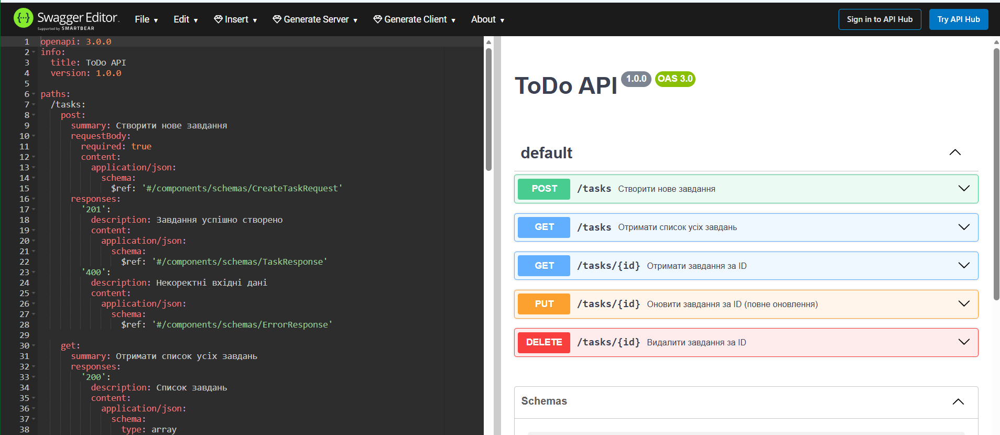

[](https://github.com/Guard1k/Web-Lab/actions/workflows/ci.yml)

# Web-Lab

## АРІ документація

Наш контракт API описаний у `docs/api/openapi.yaml`.



## Запуск через Docker

Щоб запустити проєкт у Docker:

1. Переконайтесь, що Docker Desktop встановлено та працює.
2. У корені проєкту виконайте:

   ```bash
   docker compose up -d --build
3. Відкрийте в браузері:http://localhost:3000

Додаткові команди:

# Перевірити запущені контейнери
docker ps

# Подивитись логи бекенда
docker logs flask-app

# Зупинити систему
docker compose down